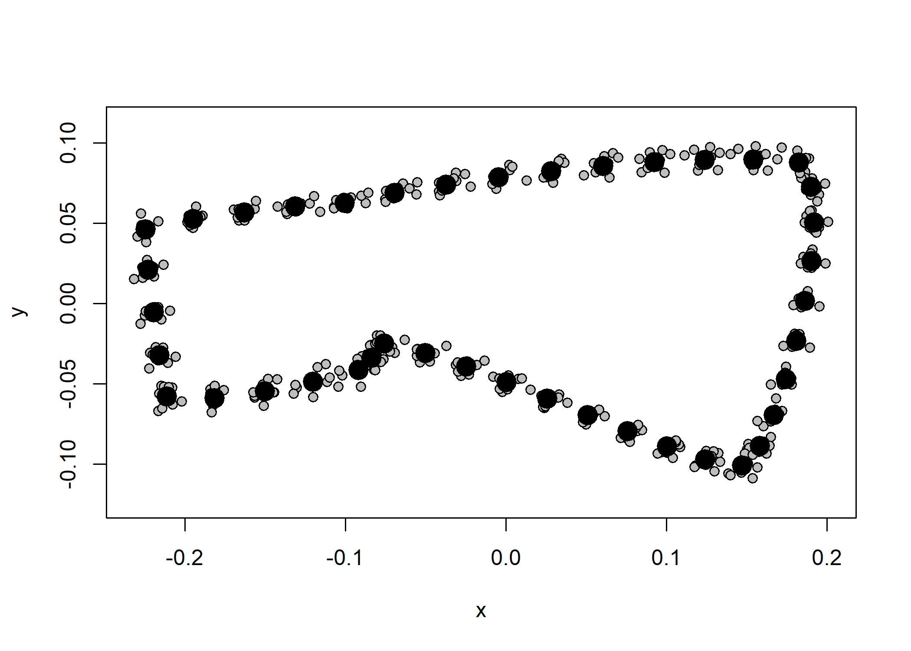
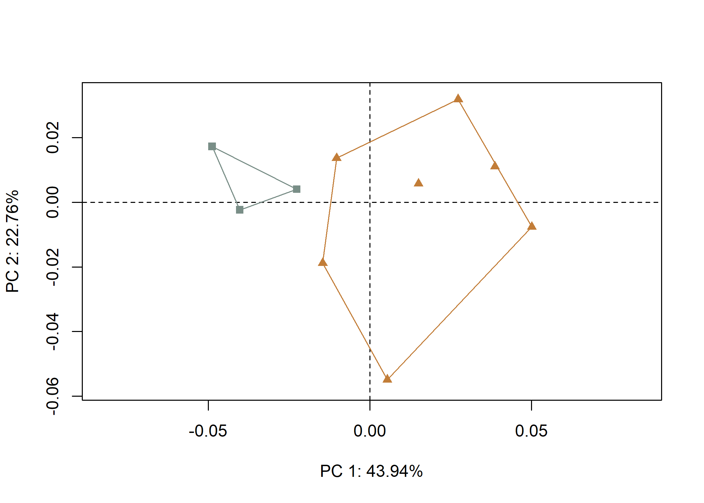

Supplementary materials for paper: Inferences to individual makers?
French trade axe morphology and makers’ marks from the La Belle
shipwreck
================
Robert Z. Selden, Jr.
03 November, 2022

## Load packages

``` r
# install
devtools::install_github("mlcollyer/RRPP")
```

    ## Downloading GitHub repo mlcollyer/RRPP@HEAD

    ## 
    ##          checking for file 'C:\Users\seldenjrz\AppData\Local\Temp\RtmpAfYb0w\remotes1e501d443863\mlcollyer-RRPP-7a60a15/DESCRIPTION' ...     checking for file 'C:\Users\seldenjrz\AppData\Local\Temp\RtmpAfYb0w\remotes1e501d443863\mlcollyer-RRPP-7a60a15/DESCRIPTION' ... OK  ✔  checking for file 'C:\Users\seldenjrz\AppData\Local\Temp\RtmpAfYb0w\remotes1e501d443863\mlcollyer-RRPP-7a60a15/DESCRIPTION' (491ms)
    ##            ─  preparing 'RRPP': (334ms)
    ## ✔  checking DESCRIPTION meta-information
    ##       ─  checking for LF line-endings in source and make files and shell scripts
    ##       ─  checking for empty or unneeded directories
    ##       ─  building 'RRPP_1.3.1.999.tar.gz'
    ##      
    ## 

``` r
devtools::install_github("geomorphR/geomorph", ref = "Stable", build_vignettes = TRUE)
```

    ## Downloading GitHub repo geomorphR/geomorph@Stable

    ## 
    ##          checking for file 'C:\Users\seldenjrz\AppData\Local\Temp\RtmpAfYb0w\remotes1e503c786410\geomorphR-geomorph-dd331e2/DESCRIPTION' ...     checking for file 'C:\Users\seldenjrz\AppData\Local\Temp\RtmpAfYb0w\remotes1e503c786410\geomorphR-geomorph-dd331e2/DESCRIPTION' ...   ✔  checking for file 'C:\Users\seldenjrz\AppData\Local\Temp\RtmpAfYb0w\remotes1e503c786410\geomorphR-geomorph-dd331e2/DESCRIPTION' (428ms)
    ##       ─  preparing 'geomorph': (516ms)
    ##    checking DESCRIPTION meta-information ...  ✔  checking DESCRIPTION meta-information
    ##       ─  installing the package to build vignettes (496ms)
    ##          creating vignettes ...     creating vignettes ...   ✔  creating vignettes (1m 33.8s)
    ##       ─  checking for LF line-endings in source and make files and shell scripts
    ##       ─  checking for empty or unneeded directories
    ##       ─  building 'geomorph_4.0.4.tar.gz'
    ##      
    ## 

``` r
# load
library(here)
```

    ## here() starts at D:/github/fta3dgm

``` r
library(StereoMorph)
library(geomorph)
```

    ## Loading required package: RRPP

    ## Loading required package: rgl

    ## Loading required package: Matrix

``` r
library(tidyverse)
```

    ## ── Attaching packages
    ## ───────────────────────────────────────
    ## tidyverse 1.3.2 ──

    ## ✔ ggplot2 3.3.6      ✔ purrr   0.3.5 
    ## ✔ tibble  3.1.8      ✔ dplyr   1.0.10
    ## ✔ tidyr   1.2.1      ✔ stringr 1.4.1 
    ## ✔ readr   2.1.3      ✔ forcats 0.5.2 
    ## ── Conflicts ────────────────────────────────────────── tidyverse_conflicts() ──
    ## ✖ tidyr::expand() masks Matrix::expand()
    ## ✖ dplyr::filter() masks stats::filter()
    ## ✖ dplyr::lag()    masks stats::lag()
    ## ✖ tidyr::pack()   masks Matrix::pack()
    ## ✖ tidyr::unpack() masks Matrix::unpack()

``` r
library(wesanderson)
```

## Generalised Procrustes Analysis

Landmark data were aligned to a global coordinate system (Kendall 1981,
1984; Slice 2001), achieved through generalised Procrustes
superimposition (Rohlf and Slice 1990) performed in R 4.0.4 (R Core
Development Team, 2021) using the `geomorph` library v. 3.3.2 (Adams et
al. 2017; Adams and Otárola-Castillo 2013). Procrustes superimposition
translates, scales, and rotates the coordinate data to allow for
comparisons among objects (Gower 1975; Rohlf and Slice 1990). The
`geomorph` package uses a partial Procrustes superimposition that
projects the aligned specimens into tangent space subsequent to
alignment in preparation for the use of multivariate methods that assume
linear space (Rohlf 1999; Slice 2001).

``` r
# gpa ----
Y.gpa <- gpagen(coords, print.progress = FALSE)
plot(Y.gpa)
```



``` r
# geomorph data frame ----
gdf <- geomorph.data.frame(shape = Y.gpa$coords, 
                           size = Y.gpa$Csize,
                           mark = qdata$mark)

# add centroid size to qdata ----
qdata$csz <- Y.gpa$Csize

# print qdata
knitr::kable(qdata, align = "lccc", caption = "Attributes included in qdata.")
```

|            | cask  |   mark   |   csz    |
|:-----------|:------|:--------:|:--------:|
| 11373-2.20 | 11373 | asterisk | 447.6635 |
| 11373-2.21 | 11373 | asterisk | 499.3537 |
| 11373-2.23 | 11373 |    DG    | 421.9203 |
| 11373-2.28 | 11373 | asterisk | 502.4541 |
| 11375-2.3  | 11375 |    DG    | 444.6668 |
| 11375-2.40 | 11375 |    DG    | 442.0828 |
| 11375-2.45 | 11375 |    DG    | 468.6789 |
| 11411-2.10 | 11411 |    DG    | 471.1334 |
| 11411-2.24 | 11411 |    DG    | 419.2457 |
| 11411-2.29 | 11411 |    DG    | 420.7324 |

Attributes included in qdata.

### Variation in French trade axe centroid size by mark

``` r
# attributes for boxplots ----
csz <- qdata$csz # centroid size
cask <- qdata$cask # cask
mark <- qdata$mark  # mark

# boxplot of axe centroid size by mark ----
csz.mark <- ggplot(qdata, aes(x = mark, y = csz, color = mark)) + 
  geom_boxplot() +
  geom_dotplot(binaxis = 'y', stackdir = 'center', dotsize = 0.3) +
  scale_colour_manual(values = wes_palette("Moonrise2")) +
  theme(legend.position = "none") +
  labs(x = 'Mark', y = 'Centroid Size')
# render plot
csz.mark
```

    ## Bin width defaults to 1/30 of the range of the data. Pick better value with `binwidth`.


## Principal Components Analysis

Principal components analysis (Jolliffe 2002) was used to visualise
shape variation among the axes The shape changes described by each
principal axis are commonly visualized using thin-plate spline warping
of a reference 3D mesh (Klingenberg 2013; Sherratt et al. 2014).

``` r
# principal components analysis
pca<-gm.prcomp(Y.gpa$coords)
summary(pca)
```

    ## 
    ## Ordination type: Principal Component Analysis 
    ## Centering by OLS mean
    ## Orthogonal projection of OLS residuals
    ## Number of observations: 10 
    ## Number of vectors 9 
    ## 
    ## Importance of Components:
    ##                              Comp1        Comp2        Comp3       Comp4
    ## Eigenvalues            0.001094911 0.0005672721 0.0004241562 0.000152132
    ## Proportion of Variance 0.439364737 0.2276343415 0.1702049650 0.061047377
    ## Cumulative Proportion  0.439364737 0.6669990784 0.8372040435 0.898251421
    ##                              Comp5        Comp6        Comp7        Comp8
    ## Eigenvalues            0.000122029 6.542674e-05 3.593658e-05 0.0000187934
    ## Proportion of Variance 0.048967665 2.625437e-02 1.442059e-02 0.0075413950
    ## Cumulative Proportion  0.947219086 9.734735e-01 9.878940e-01 0.9954354443
    ##                               Comp9
    ## Eigenvalues            1.137502e-05
    ## Proportion of Variance 4.564556e-03
    ## Cumulative Proportion  1.000000e+00

``` r
# set plot parameters to plot by mark
pch.gps <- c(15,17)[as.factor(mark)]
col.gps <- wes_palette("Moonrise2")[as.factor(mark)]
col.hull <- c("#798E87","#C27D38")

# plot pca by mark
pc.plot1 <- plot(pca, 
                 asp = 1,
                 pch = pch.gps,
                 col = col.gps)
shapeHulls(pc.plot1, 
           groups = mark,
           group.cols = col.hull)
```



### Minima/maxima of PC1/2

``` r
# plot x/y maxima/minima
## x - minima
mean.shape <- mshape(Y.gpa$coords)
plotRefToTarget(pca$shapes$shapes.comp1$min, 
                mean.shape)
```


``` r
## x - maxima
plotRefToTarget(pca$shapes$shapes.comp1$max, 
                mean.shape)
```


``` r
## y - minima
plotRefToTarget(pca$shapes$shapes.comp2$min, 
                mean.shape)
```


``` r
## y - maxima
plotRefToTarget(pca$shapes$shapes.comp2$max, 
                mean.shape)
```


## Composite PCA with warp grids

``` r
# print pca with warp grids at max/min X and max/min Y
knitr::include_graphics('./figures/pca.warp.jpg')
```


## Test hypothesis

*Hypothesis: There are morphological differences between French trade
axes from the La Belle shipwreck that bear an **asterisk** or **DG**
makers’ marks.*

``` r
# size as a function of mark ----
fit.size.mark <- procD.lm(size ~ mark, 
                          data = gdf, 
                          print.progress = FALSE, 
                          iter = 9999)

## differences in size by mark?
anova(fit.size.mark)
```

    ## 
    ## Analysis of Variance, using Residual Randomization
    ## Permutation procedure: Randomization of null model residuals 
    ## Number of permutations: 10000 
    ## Estimation method: Ordinary Least Squares 
    ## Sums of Squares and Cross-products: Type I 
    ## Effect sizes (Z) based on F distributions
    ## 
    ##           Df     SS     MS    Rsq      F      Z Pr(>F)  
    ## mark       1 3695.3 3695.3 0.4334 6.1193 1.6529 0.0253 *
    ## Residuals  8 4831.0  603.9 0.5666                       
    ## Total      9 8526.3                                     
    ## ---
    ## Signif. codes:  0 '***' 0.001 '**' 0.01 '*' 0.05 '.' 0.1 ' ' 1
    ## 
    ## Call: procD.lm(f1 = size ~ mark, iter = 9999, data = gdf, print.progress = FALSE)

``` r
# shape as a function of mark ----
fit.shape.mark <- procD.lm(shape ~ mark, 
                           data = gdf, 
                           print.progress = FALSE, 
                           iter = 9999)

## differences in shape by mark? ----
anova(fit.shape.mark)
```

    ## 
    ## Analysis of Variance, using Residual Randomization
    ## Permutation procedure: Randomization of null model residuals 
    ## Number of permutations: 10000 
    ## Estimation method: Ordinary Least Squares 
    ## Sums of Squares and Cross-products: Type I 
    ## Effect sizes (Z) based on F distributions
    ## 
    ##           Df        SS        MS     Rsq      F      Z  Pr(>F)   
    ## mark       1 0.0062247 0.0062247 0.27754 3.0732 2.1133 0.00995 **
    ## Residuals  8 0.0162036 0.0020255 0.72246                         
    ## Total      9 0.0224283                                           
    ## ---
    ## Signif. codes:  0 '***' 0.001 '**' 0.01 '*' 0.05 '.' 0.1 ' ' 1
    ## 
    ## Call: procD.lm(f1 = shape ~ mark, iter = 9999, data = gdf, print.progress = FALSE)

## Morphological integration

Are the blade and butt of the axes morphologically integrated?

``` r
land.gps <- c("A","A","B","B","A","A","A","A","A","A","B","B","B","B","B","B","B","B",
              "B","B","B","B","B","B","B","B","B","B","B","B","B","B","B","B","A","A",
              "A","A","A","A","A")
  
it <- integration.test(Y.gpa$coords,
                       partition.gp = land.gps,
                       print.progress = FALSE,
                       iter = 9999)
summary(it)
```

    ## 
    ## Call:
    ## integration.test(A = Y.gpa$coords, partition.gp = land.gps, iter = 9999,  
    ##     print.progress = FALSE) 
    ## 
    ## 
    ## 
    ## r-PLS: 0.9397
    ## 
    ## Effect Size (Z): 2.50736
    ## 
    ## P-value: 0.002
    ## 
    ## Based on 10000 random permutations

``` r
## integration plot
plot(it)
```


## Modularity test

``` r
mod <- modularity.test(Y.gpa$coords,
                       partition.gp = land.gps,
                       iter = 9999,
                       print.progress = FALSE)

summary(mod)
```

    ## 
    ## Call:
    ## modularity.test(A = Y.gpa$coords, partition.gp = land.gps, iter = 9999,  
    ##     print.progress = FALSE) 
    ## 
    ## 
    ## 
    ## CR: 0.90151
    ## 
    ## P-value: 5e-04
    ## 
    ## Effect Size: -4.31951
    ## 
    ## Based on 10000 random permutations

``` r
## modularity plot
plot(mod)
```


### Mean shapes

``` r
# mean shapes ----
new.coords<-coords.subset(A = Y.gpa$coords, 
                          group = qdata$mark)
names(new.coords)
```

    ## [1] "asterisk" "DG"

``` r
# group shape means
mean <- lapply(new.coords, mshape)

# plot mean shapes
plot(mean$asterisk) # mean shape for axes with asterisk mark
```


``` r
plot(mean$DG) # mean shape for axes with DG mark
```


``` r
# comparison plot of French trade axes bearing asterisk (gray) 
# and DG (black) marks
plotRefToTarget(mean$asterisk, 
                mean$DG, 
                method = "point",
                mag = 2)
```


### Colophon

This version of the analysis was generated on 2022-11-03 09:43:52 using
the following computational environment and dependencies:

``` r
# what R packages and versions were used?
if ("devtools" %in% installed.packages()) devtools::session_info()
```

    ## ─ Session info ───────────────────────────────────────────────────────────────
    ##  setting  value
    ##  version  R version 4.2.1 (2022-06-23 ucrt)
    ##  os       Windows 10 x64 (build 19045)
    ##  system   x86_64, mingw32
    ##  ui       RTerm
    ##  language (EN)
    ##  collate  English_United States.utf8
    ##  ctype    English_United States.utf8
    ##  tz       America/Chicago
    ##  date     2022-11-03
    ##  pandoc   2.18 @ C:/Program Files/RStudio/bin/quarto/bin/tools/ (via rmarkdown)
    ## 
    ## ─ Packages ───────────────────────────────────────────────────────────────────
    ##  package       * version   date (UTC) lib source
    ##  ape             5.6-2     2022-03-02 [1] CRAN (R 4.2.1)
    ##  assertthat      0.2.1     2019-03-21 [1] CRAN (R 4.2.1)
    ##  backports       1.4.1     2021-12-13 [1] CRAN (R 4.2.0)
    ##  base64enc       0.1-3     2015-07-28 [1] CRAN (R 4.2.0)
    ##  bezier          1.1.2     2018-12-14 [1] CRAN (R 4.2.0)
    ##  brew            1.0-8     2022-09-29 [1] CRAN (R 4.2.1)
    ##  broom           1.0.1     2022-08-29 [1] CRAN (R 4.2.1)
    ##  cachem          1.0.6     2021-08-19 [1] CRAN (R 4.2.1)
    ##  callr           3.7.3     2022-11-02 [1] CRAN (R 4.2.2)
    ##  cellranger      1.1.0     2016-07-27 [1] CRAN (R 4.2.1)
    ##  cli             3.4.1     2022-09-23 [1] CRAN (R 4.2.1)
    ##  colorspace      2.0-3     2022-02-21 [1] CRAN (R 4.2.1)
    ##  crayon          1.5.2     2022-09-29 [1] CRAN (R 4.2.1)
    ##  curl            4.3.3     2022-10-06 [1] CRAN (R 4.2.1)
    ##  DBI             1.1.3     2022-06-18 [1] CRAN (R 4.2.1)
    ##  dbplyr          2.2.1     2022-06-27 [1] CRAN (R 4.2.1)
    ##  devtools        2.4.5     2022-10-11 [1] CRAN (R 4.2.1)
    ##  digest          0.6.30    2022-10-18 [1] CRAN (R 4.2.1)
    ##  dplyr         * 1.0.10    2022-09-01 [1] CRAN (R 4.2.1)
    ##  ellipsis        0.3.2     2021-04-29 [1] CRAN (R 4.2.1)
    ##  evaluate        0.17      2022-10-07 [1] CRAN (R 4.2.1)
    ##  fansi           1.0.3     2022-03-24 [1] CRAN (R 4.2.1)
    ##  farver          2.1.1     2022-07-06 [1] CRAN (R 4.2.1)
    ##  fastmap         1.1.0     2021-01-25 [1] CRAN (R 4.2.1)
    ##  forcats       * 0.5.2     2022-08-19 [1] CRAN (R 4.2.1)
    ##  fs              1.5.2     2021-12-08 [1] CRAN (R 4.2.1)
    ##  gargle          1.2.1     2022-09-08 [1] CRAN (R 4.2.1)
    ##  generics        0.1.3     2022-07-05 [1] CRAN (R 4.2.1)
    ##  geomorph      * 4.0.4     2022-11-03 [1] Github (geomorphR/geomorph@dd331e2)
    ##  ggplot2       * 3.3.6     2022-05-03 [1] CRAN (R 4.2.1)
    ##  glue            1.6.2     2022-02-24 [1] CRAN (R 4.2.1)
    ##  googledrive     2.0.0     2021-07-08 [1] CRAN (R 4.2.1)
    ##  googlesheets4   1.0.1     2022-08-13 [1] CRAN (R 4.2.1)
    ##  gtable          0.3.1     2022-09-01 [1] CRAN (R 4.2.1)
    ##  haven           2.5.1     2022-08-22 [1] CRAN (R 4.2.1)
    ##  here          * 1.0.1     2020-12-13 [1] CRAN (R 4.2.1)
    ##  highr           0.9       2021-04-16 [1] CRAN (R 4.2.1)
    ##  hms             1.1.2     2022-08-19 [1] CRAN (R 4.2.1)
    ##  htmltools       0.5.3     2022-07-18 [1] CRAN (R 4.2.1)
    ##  htmlwidgets     1.5.4     2021-09-08 [1] CRAN (R 4.2.1)
    ##  httpuv          1.6.6     2022-09-08 [1] CRAN (R 4.2.1)
    ##  httr            1.4.4     2022-08-17 [1] CRAN (R 4.2.1)
    ##  jpeg            0.1-9     2021-07-24 [1] CRAN (R 4.2.0)
    ##  jsonlite        1.8.3     2022-10-21 [1] CRAN (R 4.2.1)
    ##  knitr           1.40      2022-08-24 [1] CRAN (R 4.2.1)
    ##  labeling        0.4.2     2020-10-20 [1] CRAN (R 4.2.0)
    ##  later           1.3.0     2021-08-18 [1] CRAN (R 4.2.1)
    ##  lattice         0.20-45   2021-09-22 [1] CRAN (R 4.2.1)
    ##  lifecycle       1.0.3     2022-10-07 [1] CRAN (R 4.2.1)
    ##  lubridate       1.8.0     2021-10-07 [1] CRAN (R 4.2.1)
    ##  magrittr        2.0.3     2022-03-30 [1] CRAN (R 4.2.1)
    ##  MASS            7.3-58.1  2022-08-03 [1] CRAN (R 4.2.1)
    ##  Matrix        * 1.5-1     2022-09-13 [1] CRAN (R 4.2.1)
    ##  memoise         2.0.1     2021-11-26 [1] CRAN (R 4.2.1)
    ##  mime            0.12      2021-09-28 [1] CRAN (R 4.2.0)
    ##  miniUI          0.1.1.1   2018-05-18 [1] CRAN (R 4.2.1)
    ##  modelr          0.1.9     2022-08-19 [1] CRAN (R 4.2.1)
    ##  munsell         0.5.0     2018-06-12 [1] CRAN (R 4.2.1)
    ##  nlme            3.1-160   2022-10-10 [1] CRAN (R 4.2.1)
    ##  pillar          1.8.1     2022-08-19 [1] CRAN (R 4.2.1)
    ##  pkgbuild        1.3.1     2021-12-20 [1] CRAN (R 4.2.1)
    ##  pkgconfig       2.0.3     2019-09-22 [1] CRAN (R 4.2.1)
    ##  pkgload         1.3.1     2022-10-28 [1] CRAN (R 4.2.1)
    ##  png             0.1-7     2013-12-03 [1] CRAN (R 4.2.0)
    ##  prettyunits     1.1.1     2020-01-24 [1] CRAN (R 4.2.1)
    ##  processx        3.8.0     2022-10-26 [1] CRAN (R 4.2.1)
    ##  profvis         0.3.7     2020-11-02 [1] CRAN (R 4.2.1)
    ##  promises        1.2.0.1   2021-02-11 [1] CRAN (R 4.2.1)
    ##  ps              1.7.2     2022-10-26 [1] CRAN (R 4.2.1)
    ##  purrr         * 0.3.5     2022-10-06 [1] CRAN (R 4.2.1)
    ##  R6              2.5.1     2021-08-19 [1] CRAN (R 4.2.1)
    ##  Rcpp            1.0.9     2022-07-08 [1] CRAN (R 4.2.1)
    ##  readr         * 2.1.3     2022-10-01 [1] CRAN (R 4.2.1)
    ##  readxl          1.4.1     2022-08-17 [1] CRAN (R 4.2.1)
    ##  remotes         2.4.2     2021-11-30 [1] CRAN (R 4.2.1)
    ##  reprex          2.0.2     2022-08-17 [1] CRAN (R 4.2.1)
    ##  rgl           * 0.110.2   2022-09-26 [1] CRAN (R 4.2.1)
    ##  rjson           0.2.21    2022-01-09 [1] CRAN (R 4.2.0)
    ##  rlang           1.0.6     2022-09-24 [1] CRAN (R 4.2.1)
    ##  rmarkdown       2.17      2022-10-07 [1] CRAN (R 4.2.1)
    ##  Rook            1.1-1     2014-10-20 [1] CRAN (R 4.2.1)
    ##  rprojroot       2.0.3     2022-04-02 [1] CRAN (R 4.2.1)
    ##  RRPP          * 1.3.1.999 2022-09-12 [1] Github (mlcollyer/RRPP@7a60a15)
    ##  rstudioapi      0.14      2022-08-22 [1] CRAN (R 4.2.1)
    ##  rvest           1.0.3     2022-08-19 [1] CRAN (R 4.2.1)
    ##  scales          1.2.1     2022-08-20 [1] CRAN (R 4.2.1)
    ##  sessioninfo     1.2.2     2021-12-06 [1] CRAN (R 4.2.1)
    ##  shiny           1.7.3     2022-10-25 [1] CRAN (R 4.2.1)
    ##  StereoMorph   * 1.6.7     2022-05-25 [1] CRAN (R 4.2.1)
    ##  stringi         1.7.8     2022-07-11 [1] CRAN (R 4.2.1)
    ##  stringr       * 1.4.1     2022-08-20 [1] CRAN (R 4.2.1)
    ##  svgViewR        1.4.1     2020-10-03 [1] CRAN (R 4.2.1)
    ##  tibble        * 3.1.8     2022-07-22 [1] CRAN (R 4.2.1)
    ##  tidyr         * 1.2.1     2022-09-08 [1] CRAN (R 4.2.1)
    ##  tidyselect      1.2.0     2022-10-10 [1] CRAN (R 4.2.1)
    ##  tidyverse     * 1.3.2     2022-07-18 [1] CRAN (R 4.2.1)
    ##  tiff            0.1-11    2022-01-31 [1] CRAN (R 4.2.0)
    ##  tzdb            0.3.0     2022-03-28 [1] CRAN (R 4.2.1)
    ##  urlchecker      1.0.1     2021-11-30 [1] CRAN (R 4.2.1)
    ##  usethis         2.1.6     2022-05-25 [1] CRAN (R 4.2.1)
    ##  utf8            1.2.2     2021-07-24 [1] CRAN (R 4.2.1)
    ##  vctrs           0.5.0     2022-10-22 [1] CRAN (R 4.2.1)
    ##  wesanderson   * 0.3.6     2018-04-20 [1] CRAN (R 4.2.1)
    ##  withr           2.5.0     2022-03-03 [1] CRAN (R 4.2.1)
    ##  xfun            0.34      2022-10-18 [1] CRAN (R 4.2.1)
    ##  xml2            1.3.3     2021-11-30 [1] CRAN (R 4.2.1)
    ##  xtable          1.8-4     2019-04-21 [1] CRAN (R 4.2.1)
    ##  yaml            2.3.6     2022-10-18 [1] CRAN (R 4.2.1)
    ## 
    ##  [1] C:/Users/seldenjrz/AppData/Local/Programs/R/R-4.2.1/library
    ## 
    ## ──────────────────────────────────────────────────────────────────────────────

Current Git commit details are:

``` r
# where can I find this commit? 
if ("git2r" %in% installed.packages() & git2r::in_repository(path = ".")) git2r::repository(here::here())  
```

    ## Local:    main D:/github/fta3dgm
    ## Remote:   main @ origin (https://github.com/aksel-blaise/fta3dgm)
    ## Head:     [6f7692d] 2021-05-14: <install>

## References cited

<div id="refs" class="references csl-bib-body hanging-indent">

<div id="ref-RN11530" class="csl-entry">

Adams, Dean C., Michael L. Collyer, Antigoni Kaliontzopoulou, and Emma
Sherratt. 2017. “<span class="nocase">Package ’geomorph’: Geometric
Morphometric Analyses of 2D/3D Landmark Data. R package version
3.0.5</span>.” <http://geomorphr.github.io/geomorph/>.

</div>

<div id="ref-RN1774" class="csl-entry">

Adams, Dean C., and Erik Otárola-Castillo. 2013. “<span
class="nocase">geomorph: An R Package for the Collection and Analysis of
Geometric Morphometric Shape Data</span>.” *Methods in Ecology and
Evolution* 4 (4): 393–99. <https://doi.org/10.1111/2041-210x.12035>.

</div>

<div id="ref-RN11564" class="csl-entry">

Gower, J. C. 1975. “Generalized Procrustes Analysis.” *Psychometrika* 40
(1): 33–51. https://doi.org/<https://doi.org/10.1007/BF02291478>.

</div>

<div id="ref-RN1746" class="csl-entry">

Jolliffe, Ian T. 2002. *Principal Component Analysis*. New York:
Springer.

</div>

<div id="ref-RN11622" class="csl-entry">

Kendall, David G. 1981. “<span class="nocase">The Statistics of
Shape</span>.” In *Interpreting Multivariate Data*, edited by V.
Barnett, 75–80. New York: Wiley.

</div>

<div id="ref-RN11623" class="csl-entry">

———. 1984. “<span class="nocase">Shape Manifolds, Procrustean Metrics,
and Complex Projective Spaces</span>.” *Bulletin of the London
Mathematical Society* 16 (2): 81–121.
<https://doi.org/10.1112/blms/16.2.81>.

</div>

<div id="ref-RN1731" class="csl-entry">

Klingenberg, Christian Peter. 2013. “<span class="nocase">Visualizations
in Geometric Morphometrics: How to Read and How to Make Graphs Showing
Shape Changes</span>.” *Hystrix* 24 (1): 15–24.
https://doi.org/<http://dx.doi.org/10.4404/hystrix-24.1-7691>.

</div>

<div id="ref-R" class="csl-entry">

R Core Development Team,. 2021. *R: A Language and Environment for
Statistical Computing*. Vienna, Austria: R Foundation for Statistical
Computing. <http://www.R-project.org/>.

</div>

<div id="ref-RN1646" class="csl-entry">

Rohlf, F. James. 1999. “<span class="nocase">Shape Statistics:
Procrustes Superimpositions and Tangent Spaces</span>.” *Journal of
Classification* 16 (2): 197–223.
<https://doi.org/10.1007/s003579900054>.

</div>

<div id="ref-RN478" class="csl-entry">

Rohlf, F. James, and Dennis Slice. 1990. “<span
class="nocase">Extensions of the Procrustes Method for the Optimal
Superimposition of Landmarks</span>.” *Systematic Zoology* 39 (1):
40–59. <https://doi.org/10.2307/2992207>.

</div>

<div id="ref-RN479" class="csl-entry">

Sherratt, E., D. J. Gower, C. P. Klingenberg, and M. Wilkinson. 2014.
“<span class="nocase">Evolution of Cranial Shape in Caecilians
(Amphibia: Gymnophiona)</span>.” *Evolutionary Biology* 41 (4): 528–45.
https://doi.org/<https://doi.org/10.1007/s11692-014-9287-2>.

</div>

<div id="ref-RN11563" class="csl-entry">

Slice, Dennis E. 2001. “<span class="nocase">Landmark Coordinates
Aligned by Procrustes Analysis Do Not Lie in Kendall’s Shape
Space</span>.” *Systematic Biology* 50 (1): 141–49.
<https://doi.org/10.1080/10635150119110>.

</div>

</div>
